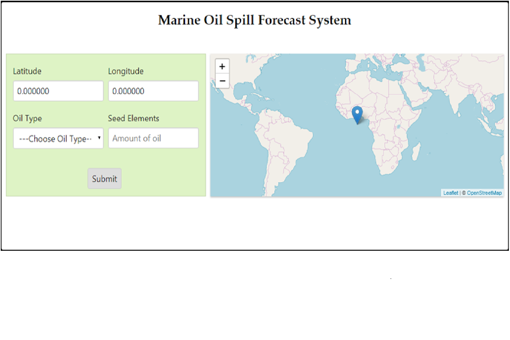
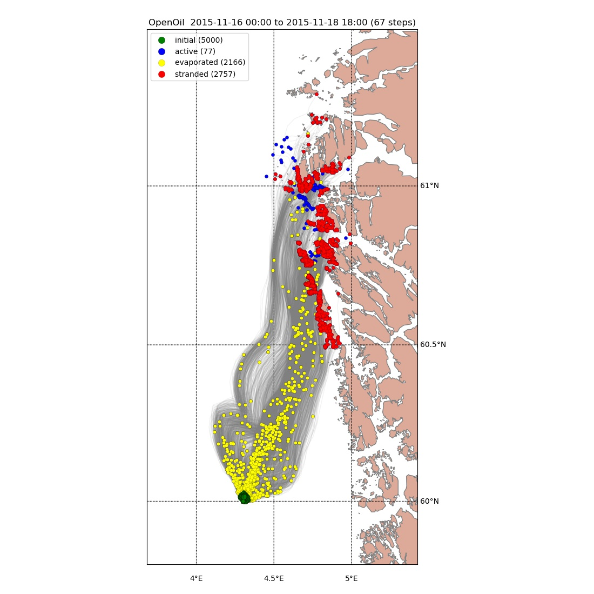

# Marine Oil Spill
Predicting the trajectory of Marine oil spill

<ul>
  <li>Marine Oil spill is one of the most common types of environmental disaster which usually occurs due to the release of crude oil from tanker ships, offshore platform and drilling mines into the sea or ocean. </li>
</ul>

## Objective
  The main objective of this project is to predict the trajectory of the oil spill in Ocean or Sea domain, so that it will be useful in establishing an effective recovery plan to prevent further spreading of oil. 

## Solution

This project uses both vector approach and Lagrangian model for the prediction of trajectory of the oil slick. The data for this project is accessed from <b> NOAA platform (National Oceanic and Atmospheric Administration) </b>

## Project flow

<ul>
  <li> Below is the view of the front-end page.</li>
  
  <li> The user can either directly specify the latitute & longitude or pin the location in the map which in turn will auto-populate the co-ordinates. </li>
  <li> Once all the input values are provided the application generates a image and gif as follow</li>
  <li> The gif shows the trajectory of oil spill for a duration of 3 days and time change can be seen at the top of the gif </li> 
  
  <li> The image helps us to get a deeper insight about the spills path which in turn points out various parameters like,
      <ul>
      <li> Initial spill location – Green color</li>
      <li> Active oil – Blue color</li>
      <li> Stranded oil – Red color </li>
        <li> Evaporated oil – Yellow color </li></ul></li>
  
  </ul>
  
## Framework

  The entire modelling was done using <b> Opendrift Framework. </b>
  It is an open source framework used for Ocean Trajectory Modelling
  
